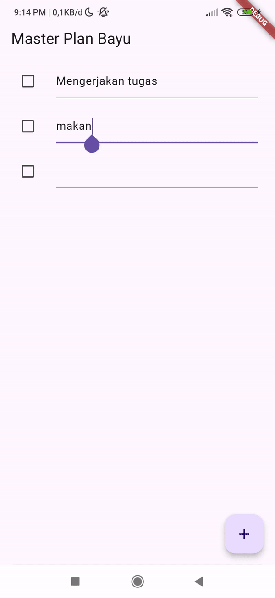
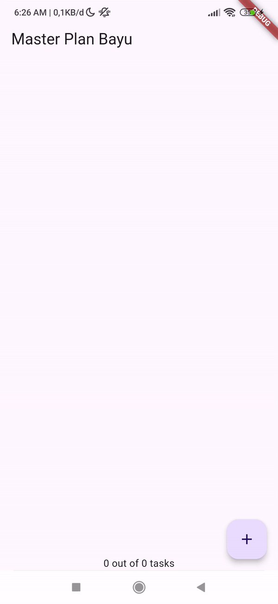
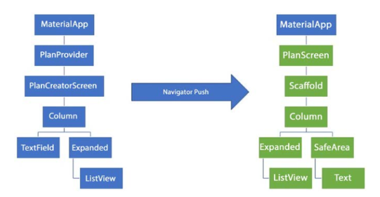
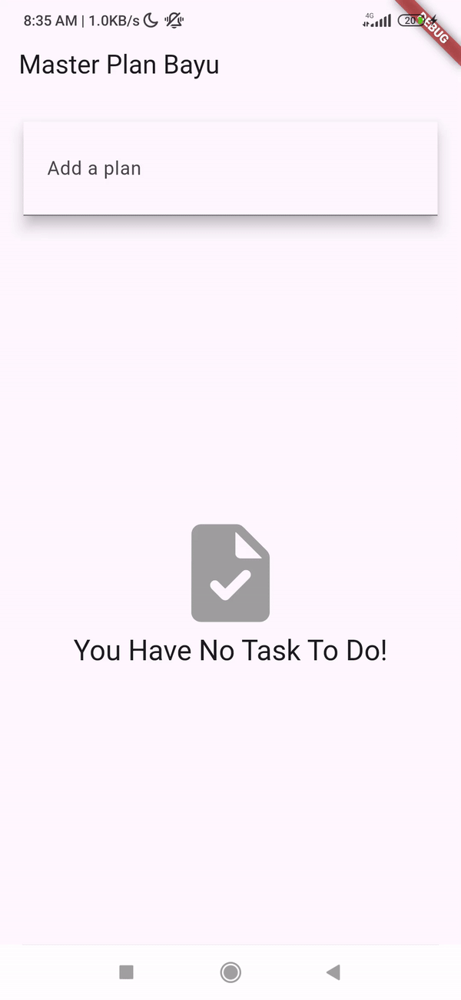

# master_plan

## Getting Started
**Tugas Praktikum 1: Dasar State dengan Model-View**
1. Selesaikan langkah-langkah praktikum tersebut, lalu dokumentasikan berupa GIF hasil akhir praktikum beserta penjelasannya di file README.md! Jika Anda menemukan ada yang error atau tidak berjalan dengan baik, silakan diperbaiki.

2. Jelaskan maksud dari langkah 4 pada praktikum tersebut! Mengapa dilakukan demikian?\
    **Jawab:** \
    Hal tersebut dilakukan untuk memudahkan import file plan.dart dan task.dart pada file lain (hanya membutuhkan satu perintah import).
3. Mengapa perlu variabel plan di langkah 6 pada praktikum tersebut? Mengapa dibuat konstanta ?\
**Jawab**
Karena variabel plan digunakan untuk menyimpan instance dari model Plan, yang merepresentasikan rencana atau daftar tugas dalam aplikasi. Variabel tersebut dibuat konstanta agar tetap dan tidak berubah setelah dibuat.

4. Lakukan capture hasil dari Langkah 9 berupa GIF, kemudian jelaskan apa yang telah Anda buat!

5. Apa kegunaan method pada Langkah 11 dan 13 dalam lifecyle state ?
method initState() digunakan untuk menginisialisasi objek state sebelum widget dibangun. Sedangkan method dispose() adalah metode yang dipanggil saat objek state dihapus dari widget tree, misalnya ketika widget dihapus dari tampilan atau widget induknya dihapus.

---
**Tugas Praktikum 2: InheritedWidget**
1. Jelaskan mana yang dimaksud InheritedWidget pada langkah 1 tersebut! Mengapa yang digunakan InheritedNotifier?
2. Jelaskan maksud dari method di langkah 3 pada praktikum tersebut! Mengapa dilakukan demikian?
3. Lakukan capture hasil dari Langkah 9 berupa GIF, kemudian jelaskan apa yang telah Anda buat!

---
**Tugas Praktikum 3: InheritedWidget**
1. Berdasarkan Praktikum 3 yang telah Anda lakukan, jelaskan maksud dari gambar diagram berikut ini!

2. Lakukan capture hasil dari Langkah 14 berupa GIF, kemudian jelaskan apa yang telah Anda buat!

