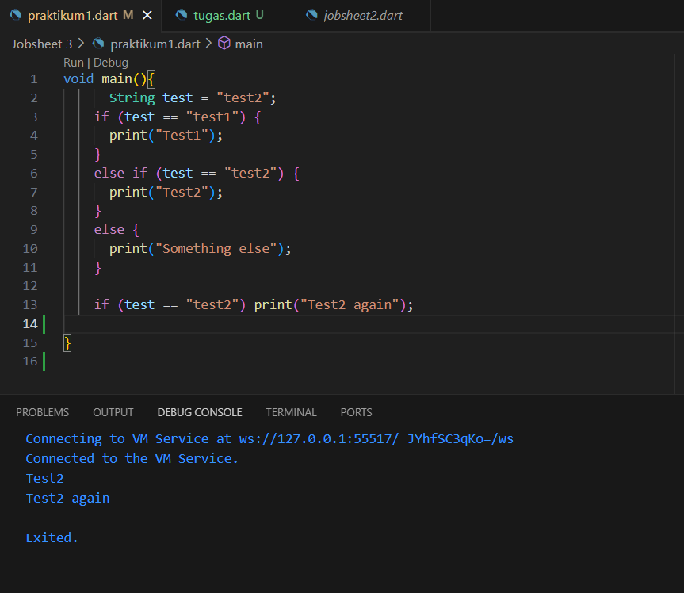
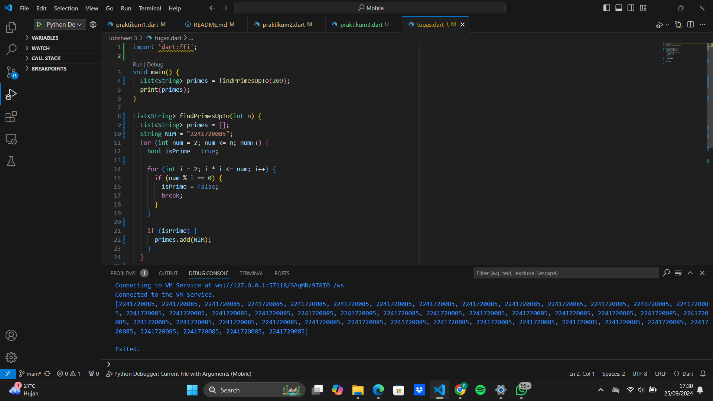

### Pemrograman Mobile - Pertemuan 3 ###
---
**NIM :** 2241720085

**Nama  :** Fajar Bayu Kusuma

---
**Praktikum 1**

- Langkah 1 dan 2
Hasil setelah perbaikan karena ada eror

Pada langkah 1 ini ketika dirun terjadi eror, karena ada kesalahan penulisan sintaks pada beberapa kata. lalu setelah diperbaiki hasilnya seperti gambar diatas

- Langkah 3
Pada proses penambahan kode ini, terdapat kesalahan sebagai berikut

Hal tersebut karena variabel test sudah diinisialisasikan pada kode program sebelumnya. Jadi untuk mengatasi eror tersebut saya membuat nama baru untuk variabel tersebut. Sepeti dibawah ini.

---
**Praktikum 2**

- Langkah 1

- Langkah 2 \
Ketika kode program langkah 1 ini dijalankan, terdapat kesalahan atau eror pada variabel counter. Hal ini dikarenakan variabel "counter" belum di inisialisasi.
Perbaikan pada kode program langkah 1 yaitu sebagai berikut.

- Langkah 3\
Pada langkah 3 ini dilakukan penambahan kode sebagai berikut: 

Pada langkah 3 ini tidak terjadi pesan eror, karena pada perulangan "do while" ini akan melanjutkan setelah perulangan "while" dengan nilai "counter" sudah 32 dan akan diprint selama counter bernilai kurang dari 77.
---
**Praktikum 3**
- Langkah 1

Pada penulisan kode langkah 1 ini berupa variabel "Index" yang belum diinisialisasikan. Hal ini yang menyebabkan eror seperti pada gambar diatas

- Langkah 2
Pada langkah 2 ini, dilakukan perbaikan pada kode program langkah 1, yaitu dengan menambahkan tipe data berupa int. Dan hasilnya seperi digambar bawah ini.

- Langkah 3\
Pada langkah ketiga ini yaitu adanya penambahan kode seperti berikut:

Namun masih terjadi eror hal ini dikarenakan kesalahan pada penulisan sintaks kode program. Untuk perbaikan kode program akan menjadi seperti ini. 

Pada langkah ketiga tersebut sebenarnya tidak terjadi. Namun output yang dihasilkan tidak ada, karena nilai index diawal yaitu 10. Yang mana nilai ini sudah terpenuhi pada sintaks "else if (index >1 || index < 7) continue. Hal ini menyebakakn jika kondisi salah satu terpenuhi makan akan dilakukan continue. Dan index dimuali dari 10 dan akan terus bertambah maka nilai index tidak ada yang di print karena 10>1.
Untuk perihal berikut saya membuat modifikasi pada program tersebut sebagai berikut:

---
**TUGAS PRAKTIKUM**
Pada tugas praktikum kali ini yaitu mencari nilai bilangan prima dari 0-201. Jika terdapat bilangan prima maka akan diprint NIM saya yaitu 2241720085. Untuk kodenya sebagai berikut:
 
Untuk penjelasannya yaitu:
1. Di buat sebuah fungsi dengan nama findPrimeUpTo(int n)
2. Lalu didalam fungsi tersebut terdapat sebuah list<String> bernama primes.
3. lalu dibuat sebuah variabel dengan tipe data string berupa NIM
4. Llau dijalankan sebauh perulangan for dengan inisialisasi num =2 (karena prima dimulai dari 2)
5. lalu num <=n, nilai n sesuai yang diinputkan di fungsi main
6. lalu nilai num akan terus ditambah 1
7. lalu ada varibale dengan tipe data bolean bernama isPrime = true
8. Lalu didalam for tersebut ada for lagi dimana nilai i = 2, i*i <=num, dan nilai i++
9. pada baris tersebut digunakan untuk melakukan perulangan i, yang mana jika num % i (2) = 0, maka nilai i tersebut bukan prima, jadi varibael isPrime = False, dan dilakukan break

10. lalu jika nilai tersebut bernilai isPrime bernilai true maka nim akan ditambahkan pada array primes
11. lalu pada fungsi main dipanggil fungsi findPrimeUpTo(209), jadi nilai n adalah 209
12. dan langkah terakhir yaitu nilai array primes akan diprint semua

