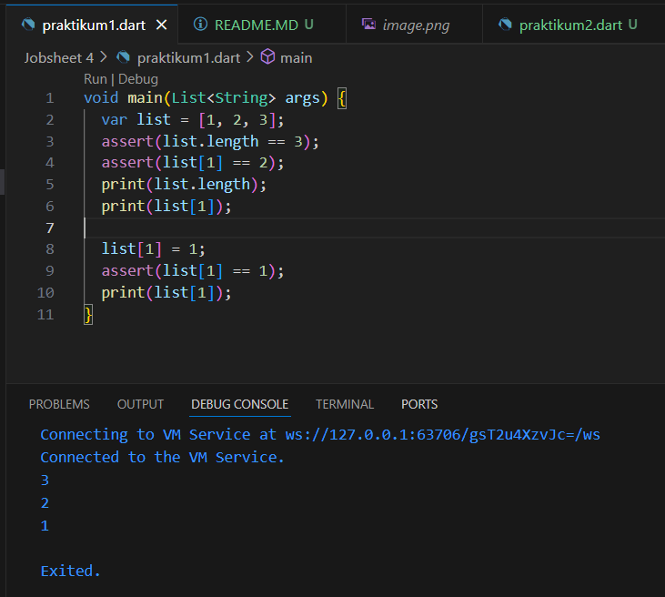

### Pemrograman Mobile - Pertemuan 4 ###
---
**NIM :** 2241720085

**Nama  :** Fajar Bayu Kusuma

---
**Praktikum 1**
- Langkah 1 dan 2 \
tidak terjadi eror, hasilnya seperti ini
 \
pada praktikum ini terdapat sebuah variabel bernama list dengan panjang array 3 dengan isi [1,2,3], lalu dilakukan pengecekan dengan "assert" apakah panjang indexnya 3 dan juga nilai index ke 2 yaitu 2. Hal ini tidak eror karena kode sudah benar. \
lalu dilakukan print nilai/panjang index dan nilai dari index ke 2. \
Lalu ada perubahan nilai pada index 2 menjadi nilai 1. maka dilakukan pencekan lagi apakah index kedua bernilai 1. dan jika benar akan dapat diprint. 

- Langkah 3 \
Sintaks Code
 

---
**Praktikum 2**
- Langkah 1 dan 2 \
tidak terjadi eror, hasilnya seperti ini

- Langkah 3 \
Sintaks Code
 
 Tidak terjadi eror, akan tetapi saat melakukan cetak names1, names2, names3 kosong, hal ini dikarenakan tidak ada nilai didalam variabel tersebut.

---
**Praktikum 3**
- Langkah 1 dan 2 \
tidak terjadi eror, hasilnya seperti ini

model maps terdiri dari dua yaitu key dan value. saat kita melakukan print gifts akan menghasilkan output seperti gambar. lalu nobleGases juga sama.
- Langkah 3 \
Sintaks Code
 
tidak ada eror, dari kode diatas dapat disimpulkan bahwa nilai atau values dalam maps dapat diganti berdasarkan key (kuncinya)

---
**Praktikum 4**
- Langkah 1 dan 2 \
penjelasan variable list11 tidak didefinisikan, seharusnya list saja
pembenaran eror

variabel list1 di ruabah menjadi list, karena deklarasi awal list. apabila list1 akan eror seperti percobaan sebelumnya.
- Langkah 3 \
Sintaks Code
 

 - Langkah 4 \
Sintaks Code
 
 penjelasan Kesalahan karena variabel promoActive belum didefinisikan sebelum digunakan dalam ekspresi if di dalam daftar nav.
Sebelum menggunakan promoActive, telah mendefinisikan dan memberikan nilainya. Jikaingin menggunakan variabel promoActive sebagai penentu dalam ekspresi if, pastikan telah mendeklarasikan dan menginisialisasinya sebelum digunakan.
Kondisi = Flase
 
 Kondisi True
 
 - Langkah 5 \
Sintaks Code
 
 

 - Langkah  \
Sintaks Code
 
---
**Praktikum 4**
- Langkah 1 dan 2 \
tidak terjadi eror, hasilnya seperti ini

- Langkah 3 \
Sintaks Code
 
 eror terjadi kerna tidak ada type data pada vriable list1, sehingga saat akan di running mengalama eror, lalu karena list ini memiliki nilai int yang pasti dan bilangan bulat, maka tidak perlu menggunakan tanda ? atau safety null.
 Pembenaran Kode

---
**Praktikum 5**
- Langkah 1 dan 2 \
penjelasan saat kode tersebut dijalankan akan menghasilkan output seperti gambar, dimana akan di print nilai first, last a: 2, b: true.

- Langkah 3 \
Sintaks Code
 

hasilnya tidak ada perubahan dari kode sebelumnya pada langkah 2

Output pertama mencetak nilai record yang asli, yaitu ('first', a: 2, b: true, 'last'). Output kedua mencetak hasil pertukaran nilai dari pemanggilan fungsi tukar(), yaitu (3, 2).

penjelasan Output pertama hingga ketiga adalah output yang sama seperti sebelumnya. Output keempat hingga terakhir mencetak nilai-nilai dari variabel mahasiswa2 sesuai dengan pencetakannya:
print(mahasiswa2.$1); mencetak nilai 'first'. print(mahasiswa2.a); mencetak nilai 2. print(mahasiswa2.b); mencetak nilai true. print(mahasiswa2.$2); mencetak nilai 'last'.

---
**2. Jelaskan yang dimaksud Functions dalam bahasa Dart!**
---
- Jawab Dalam bahasa Dart, Functions (fungsi) adalah blok kode yang dapat menerima argumen, melakukan operasi, dan mengembalikan nilai. Fungsi digunakan untuk mengorganisir dan mengelompokkan kode menjadi unit yang dapat digunakan dan dipanggil secara berulang.
---
**3. Jelaskan jenis-jenis parameter di Functions beserta contoh sintaksnya!**
--
- jawab Dalam bahasa Dart, terdapat dua jenis parameter yang dapat digunakan dalam deklarasi fungsi, yaitu parameter posisi (positional parameter) dan parameter bernama (named parameter).
Parameter Posisi (Positional Parameter):

- Parameter posisi adalah parameter yang dideklarasikan berdasarkan urutan posisinya saat memanggil fungsi.

- Argumen yang dikirimkan saat memanggil fungsi akan diteruskan ke parameter posisi sesuai dengan urutan posisinya.

- Parameter posisi bersifat wajib diisi saat memanggil fungsi, kecuali jika ada nilai default yang ditentukan.

- Parameter Bernama (Named Parameter):

- Parameter bernama adalah parameter yang dideklarasikan dengan menggunakan sintaks nama_parameter: nilai.

- Ketika memanggil fungsi, argumen dikirimkan dengan menyebutkan nama parameternya, diikuti dengan tanda titik dua (:) dan nilai yang ingin diteruskan. Penggunaan parameter bernama bersifat opsional dan dapat diabaikan saat memanggil fungsi jika ada nilai default yang ditentukan.

---
**4. Jelaskan maksud Functions sebagai first-class objects beserta contoh sintaknya!**
---

- jawaban 
- Dalam bahasa pemrograman, konsep "first-class objects" (objek kelas satu) mengacu pada kemampuan untuk memperlakukan fungsi sebagai nilai yang dapat disimpan dalam variabel, dilewatkan sebagai argumen ke fungsi lain, dan dikembalikan sebagai nilai dari fungsi lain. Dalam konteks ini, fungsi diperlakukan seperti objek lainnya dalam bahasa tersebut.
---
**5. Apa itu Anonymous Functions? Jelaskan dan berikan contohnya!** 
---

- jawab Anonymous functions, juga dikenal sebagai lambda functions atau function literals, adalah fungsi yang tidak memiliki nama.
- penjelasan
- tanda kurung kurawal {} dan kata kunci => untuk mendefinisikan anonymous function. Fungsi anonim tersebut menggandakan setiap elemen dalam list numbers dan mengembalikan hasilnya. Kemudian, metode toList() untuk mengonversi hasil iterable menjadi list, dan hasilnya dicetak menggunakan print().

---
**6. Apa itu Anonymous Functions? Jelaskan dan berikan contohnya!** 
---

- Jawab Lexical scope dan lexical closures adalah konsep penting dalam pemrograman yang terkait dengan pengaturan dan akses variabel dalam suatu lingkup.
- Lexical Scope: Lexical scope (lingkup leksikal) mengacu pada cara variabel diikat (bound) dalam sebuah program berdasarkan tempat atau posisi di dalam kode.
---
**7. Jelaskan dengan contoh cara membuat return multiple value di Functions!**
---
mengembalikan sebuah List atau Array yang berisi nilai-nilai yang ingin dikembalikan. Anda dapat menempatkan nilai-nilai tersebut ke dalam sebuah List atau Array, dan kemudian mengembalikan List atau Array tersebut dari fungsi.

