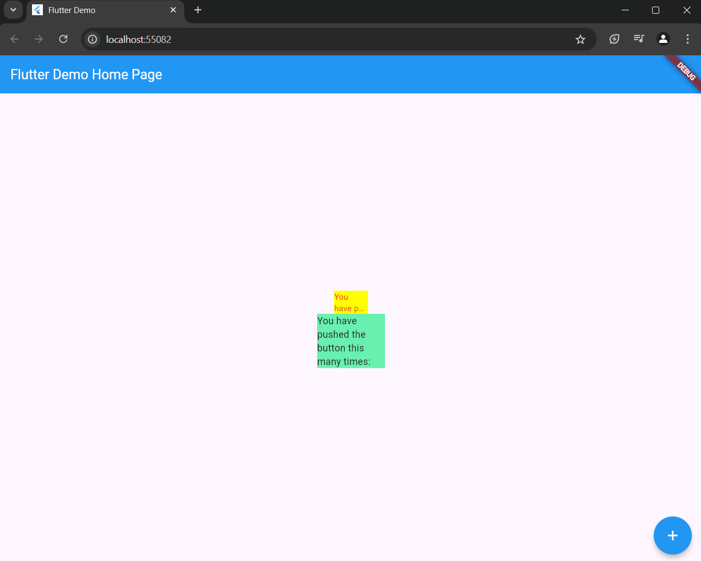

# Laporan Praktikum 7
**Nama  : Fajar Bayu Kusuma**

**NIM   : 2241720085**

#

**Langkah 2: Menambahkan Plugin**

Hasil

pada file pubspec.yaml

---

**Langkah 4: Tambah Widget AutoSizeText**

Penambahan dan terjadi Eror

Hal ini terjadi karena belum adanya pengimporan pada untuk package auto_size_text. untuk mengatasinya yaitu ditambahkan atau mengimport pakcage tersebut

---
---
**Ouput**

Setelah dilakukannya penambahan kode pada file main.dart, menghasilkan output sebagai berikut

---
## Tugas Praktikum

1. Selesaikan Praktikum tersebut, lalu dokumentasikan dan push ke repository anda berupa Screenshot hasil pekerjaan beserta penjelasan di file README.md!

2. Jelaskan maksud dari langkah 2 pada praktikum tersebut!
**Jawab** \
Pada Langkah 2 ini bertujuan  untuk menambahkan plugin auto_size_text ke dalam proyek Flutter yang telah dibuat. Secara spesifik, langkah ini bertujuan untuk memungkinkan aplikasi Flutter menyesuaikan ukuran teks secara otomatis agar sesuai dengan ruang yang tersedia, menggunakan plugin auto_size_text.

3. Jelaskan maksud dari langkah 5 pada praktikum tersebut!
**Jawab** \
Pada langkah tersebut variabel finak String text untuk mendefinisikan bahwa widget RedTextWidget akan menerima sebuah nilai berupa text atau String. Dengan menambahkan variabel text dan parameter di constructor, widget RedTextWidget sekarang bisa menampilkan teks yang dapat disesuaikan berdasarkan kebutuhan. Hal ini membuat widget lebih fleksibel dan reusable dalam berbagai konteks tanpa perlu mendefinisikan ulang widget untuk setiap teks yang berbeda.- 

4. Pada langkah 6 terdapat dua widget yang ditambahkan, jelaskan fungsi dan perbedaannya!  
**Jawab**\
RedTextWidget memberikan kontrol lebih pada gaya teks yang konsisten (dalam hal ini warna merah), sementara Text adalah widget standar yang menampilkan teks tanpa pengaturan gaya kecuali ditentukan secara manual. Kedua Container berfungsi sebagai pembungkus untuk teks, tetapi memiliki perbedaan dalam ukuran dan warna latar belakang.

5. Jelaskan maksud dari tiap parameter yang ada di dalam plugin auto_size_text berdasarkan tautan pada dokumentasi ini ! \
**Jawab:**

    - text Ini adalah teks yang akan ditampilkan oleh widget AutoSizeText. Di dalam kode, teks ini diteruskan dari konstruktor widget RedTextWidget. Teks yang diteruskan wajib diisi dan akan otomatis menyesuaikan ukurannya sesuai ruang yang tersedia.
    - style Mengatur gaya dari teks yang ditampilkan, seperti warna, ukuran font, ketebalan, dll. Pada kode ini, gaya teks diatur dengan warna merah (Colors.red) dan ukuran font 14. Jika tidak ditentukan, gaya default yang digunakan.
    - maxLines Menentukan jumlah maksimal baris yang bisa digunakan untuk menampilkan teks. Di dalam kode, maxLines: 2 berarti teks akan ditampilkan dalam maksimal dua baris. Jika teks terlalu panjang, maka sisanya akan dipotong sesuai pengaturan overflow.
    - overflow Menentukan bagaimana teks yang melebihi ruang yang tersedia harus ditampilkan. Pada kode ini, TextOverflow.ellipsis berarti teks yang melebihi batas akan dipotong dan digantikan dengan tanda elipsis (...). Nilai lainnya yang bisa digunakan adalah TextOverflow.clip (memotong teks tanpa tanda elipsis) atau TextOverflow.fade (membuat teks yang meluap memudar).

